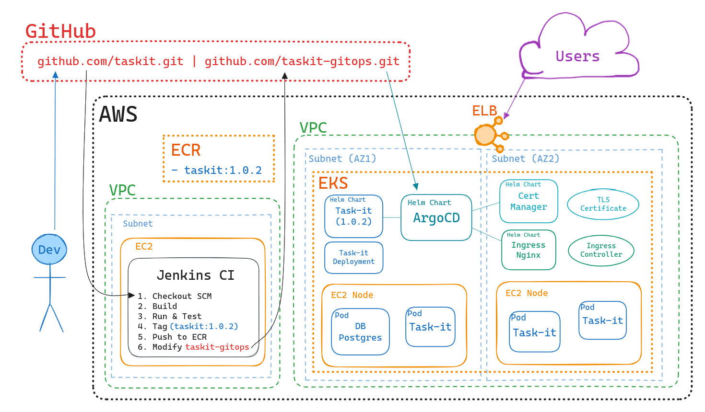

# Task-it GitOps

This repository manages the configuration for deploying the Task-it application and related infrastructure on Kubernetes using ArgoCD, as part of the GitOps workflow.

Automates the deployment of the following components:

- Task-it Application
- Ingress-Nginx Controller
- Cert-Manager
- Kube-Prometheus Stack

## Setup

Ensure you have the following prerequisites before getting started:

- Kubernetes cluster deployed
- ArgoCD installed on the cluster (See [Getting Started](https://argoproj.github.io/argo-cd/getting_started/))
- Appropriate credentials for this repository (See [Private Repositories](https://argo-cd.readthedocs.io/en/stable/user-guide/private-repositories/))

## Deployment

Apply the `infra-apps-application.yml` to deploy the Task-it application and related components:

```bash
kubectl apply -f infra-apps-application.yml
```

## Task-it GitOps Workflow



#### 1) **Continuous Development on GitHub**

The Task-it application undergoes continuous development. Developers make code changes locally and push them to the remote GitHub repository.

#### 2) **Continuous Integration - Pipeline with Jenkins**

Jenkins, the CI tool, detects changes in the GitHub repository, and based on the branch, performs the appropriate actions as part of its CI pipeline.

**For the `main` branch**:

- _Push & Tag_ - Jenkins builds and pushes a Docker image artifact with the corresponding version.
- _Deploy_ - The docker **_image tag is updated on this repository._**

#### 3) **Continuous Deployment - ArgoCD Synchronization**

ArgoCD, deployed on the Kubernetes cluster, continuously monitors this repository for changes. When the image tag is updated to the latest version by Jenkins, this change is detected and ArgoCD synchronizes the cluster's desired state with the Git repository's state.

This GitOps workflow ensures that the Kubernetes cluster is always synchronized with the state declared in this Git repository. Developers only need to focus on pushing code changes, and the CI/CD pipeline, in conjunction with Jenkins and ArgoCD, takes care of building, deploying and updating the application in the cluster.
